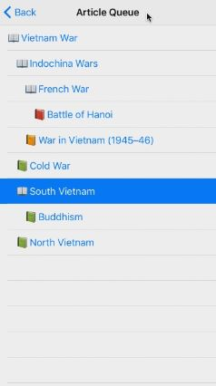

# iPhone Wikipedia Reader!
### A mobile Wikipedia reader that aims to solve the annoyances of browsing Wikipedia on mobile. 
##### *Created as part of my final project for CS 4530 Mobile App Development (iOS) at the University of Utah*

- - - - 

## Sections
 - [Rationale](#rationale)
 - [Features and Capabilities](#features-and-capabilities)
 - [Screenshots](#screenshots)
 - [Videos](#videos)

- - - -

## Rationale 
When I browse Wikipedia on PC, I tend to open dozens of tabs as I run into tangential topics of interest. I go back and fourth between open tabs and build a queue of articles I am interested in reading. Since tabs on mobile browsers are slow and clunky, this kind of browsing experience just isn’t typically possible on mobile. 

I have built a mobile Wikipedia browser where instead of immediatly following links to other articles, linked articles are automatically added to a queue of articles you are interested in viewing. This queue of articles is automatically downloaded in the background, can be quickly navigated, pushed to, and pruned as desired. The HTML and scroll position is maintained for all articles in the queue, making viewing speedy and consistent when navigating between articles.

- - - -

## Features and Capabilities

* Queue up Wikipedia articles by tapping their hyperlinks.
	* Queued articles are stored in a tree.
	* Articles will automatically be removed from the tree when you've finished with them and all their children have been viewed.
* View the tree of articles queued by navigating to the "Article Queue".
* Remove Articles from the queue by dragging left on listed articles and tapping "Delete".
* Moving back and forth between articles preserves the state/scroll position within the web view.
* Automatically traverse and clear your article queue by tapping "Next ..." on the left side of the top navigation bar.
* Fully functional on any iPhone 5 through 7 Plus and supports multiple orientations.
* Persistence between sessions.
	* Restores your article queue to the layout from the previous session.
* Lock/Unlock an article from auto-deleting by long-pressing its row in the Article Queue list.
* Super amazing awesome icon and launch image.

- - - -

## Screenshots

**Viewing an article.**

- - - - 

**The article queue.**

- - - -

**Navigating to the next article.**

- - - - 

## Videos

#### [Recording of Typical App Use](https://youtu.be/odCOLLxlNBI)
